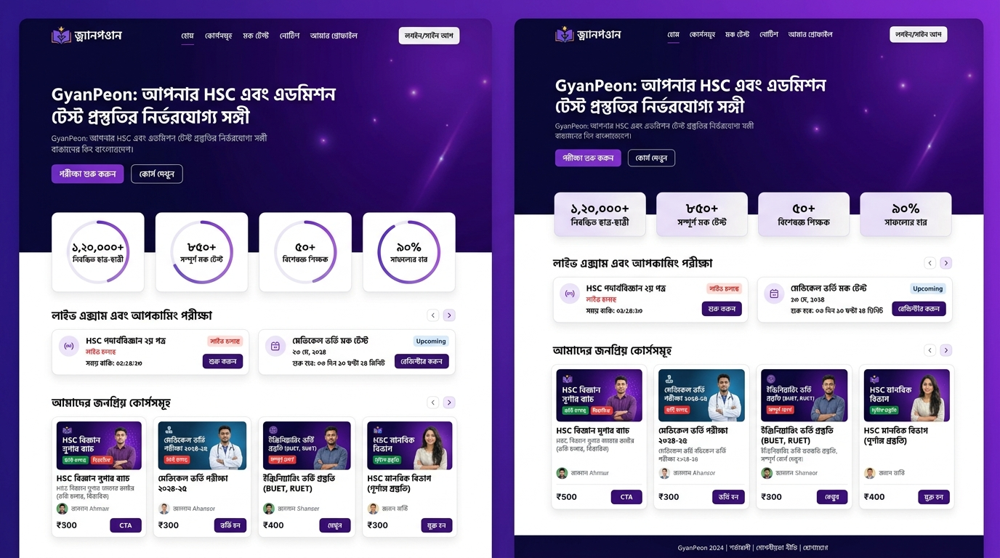
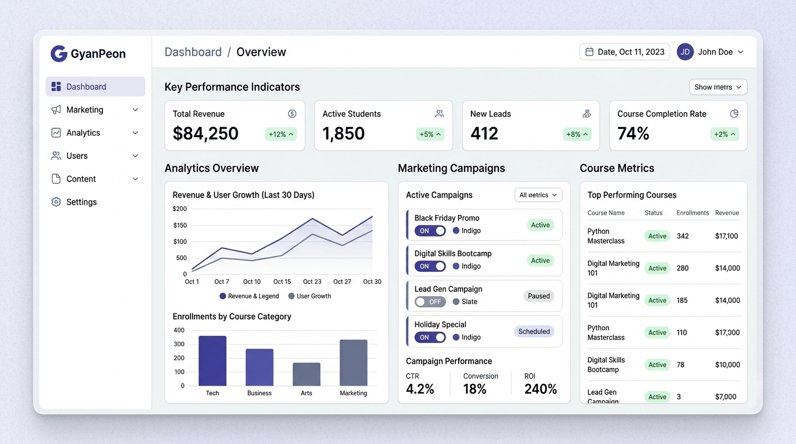

# GyanPeon (জ্ঞানপিওন) - HSC & Admission Prep Platform 🎓

GyanPeon is a highly polished, responsive, and modern landing page for an admission preparation platform tailored for HSC, Medical, and University admission aspirants in Bangladesh. 

**Official Live Site**: [https://www.gyanpeon.com/](https://www.gyanpeon.com/)

---

## 📸 Platform Previews

### 💻 Student Landing Page


### 📊 Standalone Administrative Dashboard (`/admin`)


---

## ✨ Features

- **Interactive Carousel / Stream Banners**: Seamless slider with automatic transitions featuring targeted admission courses (Medical, Engineering, University/GST).
- **Course Selection & Routing**: Clicking "বিস্তারিত দেখুন" (View Details) takes users directly to the targeted plan in the Pricing Section.
- **Unified Login/Signup Modal**: An interactive modal for users to log in or register for a free account.
- **Dual Language Support (Bengali & English)**: Toggle system for accessibility and localized content.
- **AI Study Planner Integration**: Interactive UI for planning schedules.
- **Performance Analytics & Mock Center**: Rich features to simulate real-world admission exam pressure.
- **Admin Panel Control**: Accessible control panel widget for modifying stats and checking current views.

---

## 🛠️ Tech Stack

- **Framework**: React 18 (Functional components with Hooks)
- **Build Tool**: Vite
- **Language**: TypeScript
- **Styling**: Tailwind CSS
- **Animations**: Motion (`motion/react`)
- **Icons**: Lucide React

---

## 🚀 Getting Started

To run this project locally, follow these steps:

### 1. Prerequisites
Ensure you have [Node.js](https://nodejs.org/) installed (v18 or higher recommended) along with `npm` or `yarn`.

### 2. Installation
Clone the repository (or download the source ZIP) and install dependencies:

```bash
# Clone the repository
git clone https://github.com/your-username/gyanpeon-landing-page.git

# Navigate to the project directory
cd gyanpeon-landing-page

# Install dependencies
npm install
```

### 3. Run Development Server
Start the local development server:

```bash
npm run dev
```
Open [http://localhost:3000](http://localhost:3000) (or the port shown in your terminal) to view the application in your browser.

### 4. Build for Production
To create an optimized production build of the static files:

```bash
npm run build
```
The output files will be generated in the `dist/` directory, ready to be deployed to your web server or custom hosting environment.

---

## 🌐 Production Deployment

The platform is officially hosted and accessible at:
👉 **[https://www.gyanpeon.com/](https://www.gyanpeon.com/)**

For custom production deployment to platforms like Vercel, Netlify, or Cloudflare Pages, build the project and bind your custom domain through your provider's DNS panel.

---

## 📁 File Structure

```text
├── src/
│   ├── components/            # Reusable UI sections and components
│   │   ├── Navbar.tsx         # Responsive header & language toggler
│   │   ├── Hero.tsx           # Dynamic greeting and CTAs
│   │   ├── VideoSliderSection.tsx # Admission course streaming banners
│   │   ├── PricingSection.tsx # Integrated packages and plans
│   │   ├── LoginModal.tsx     # Authentic Login & Signup popup modal
│   │   ├── FeaturesSection.tsx# Interactive core highlights
│   │   └── ...
│   ├── context/
│   │   └── LandingContext.tsx # Centralized app state management
│   ├── lib/
│   │   └── translations.ts    # Comprehensive localized English/Bengali dictionary
│   ├── App.tsx                # Main entry point holding the sections
│   ├── main.tsx               # App bootstraper
│   └── index.css              # Global styles & Tailwind directive imports
├── index.html                 # Main HTML layout
├── package.json               # System dependencies and npm script definitions
└── README.md                  # Project documentation (this file)
```

---

## 📝 License
This project is licensed under the MIT License. Feel free to use and modify it for your admission prep portal!
